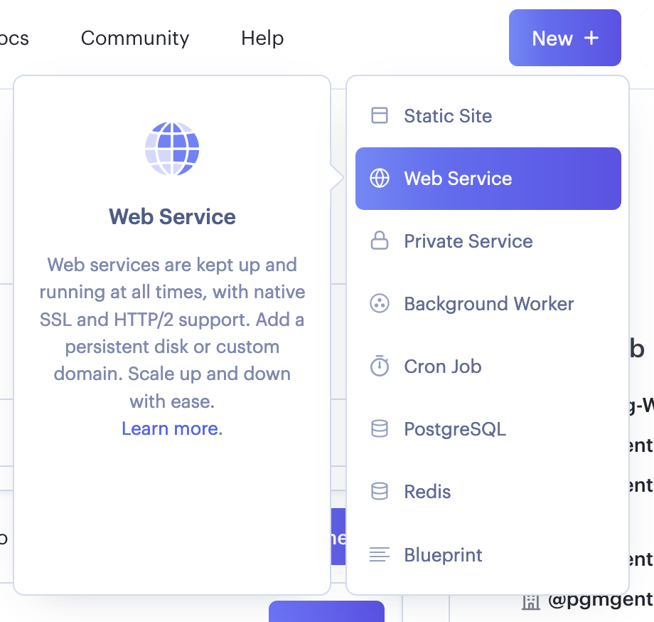
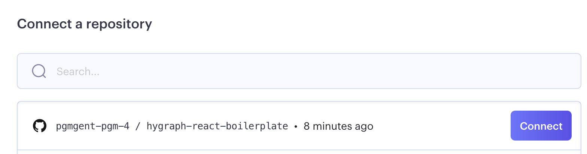
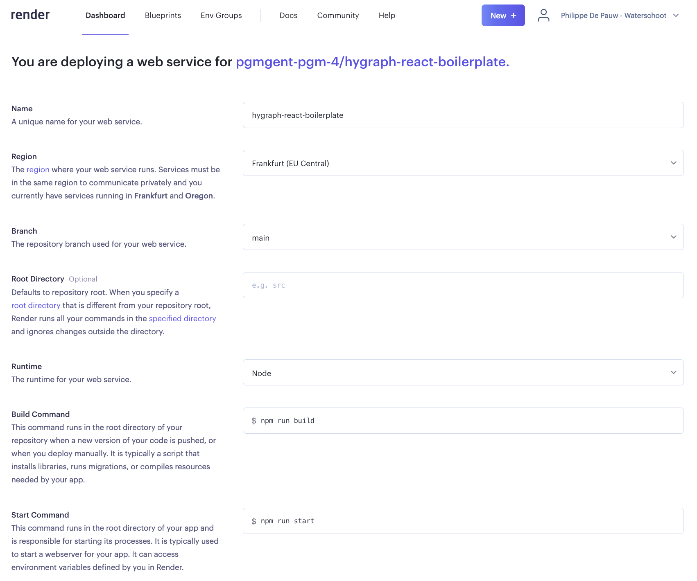
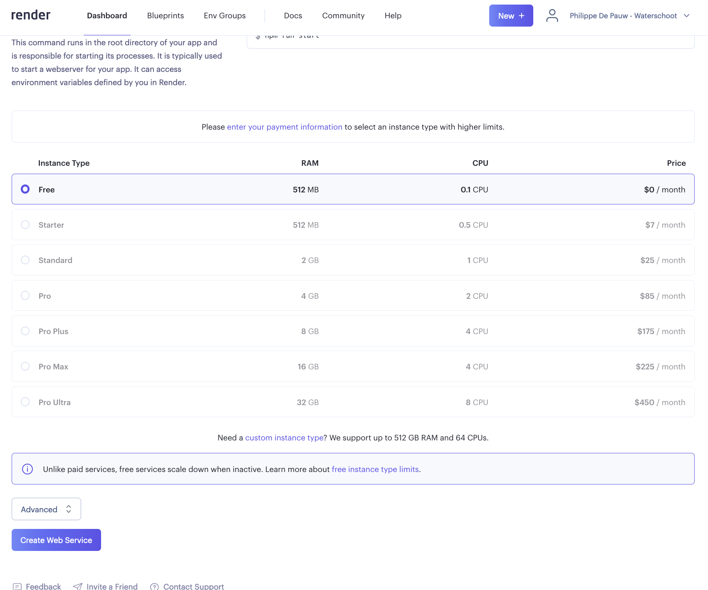

[](https://classroom.github.com/a/zYbJnoN2)
# graphcms-boilerplate

GraphCMS Boilerplate

## Client

Create a new react app with create-react-app named `client`

create `.env`-file
`.env` file under the client folder with the following content:

```
REACT_APP_NODE_ENV=development
REACT_APP_HYGRAPH_CONTENT_API=
REACT_APP_HYGRAPH_ACCESS_TOKEN=e
REACT_APP_AUTH_KEY_LOCALSTORAGE=react-boilerplate-pgm-4:currentUser
```

## Seeder

`development.env` file under server folder with the following content:

```
NODE_ENV=development
HYGRAPH_CONTENT_API=
HYGRAPH_ACCESS_TOKEN=
```

## Server

`development.env` file under server folder with the following content:

```
NODE_ENV=development
HOST=127.0.0.1
POST=8080
JWT_SECRET=
JWT_EXPIRE=24h
HYGRAPH_CONTENT_API=
HYGRAPH_ACCESS_TOKEN=
```

## Deployment

### Stap 01



### Stap 02



### Stap 03



### Stap 04


